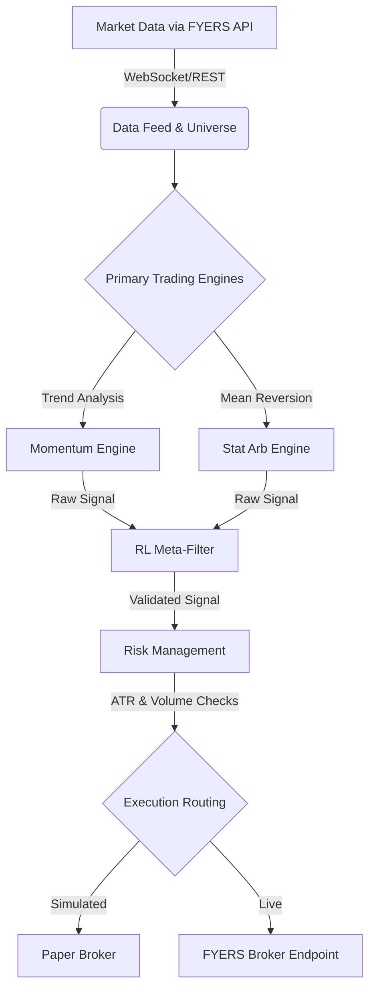

# NexusQuant: Institutional Algorithmic Trading Framework

NexusQuant is an advanced, event-driven quantitative trading architecture built in Python. It bridges complex mathematical modeling with live market execution, featuring multi-strategy trading engines, machine learning-based signal validation, and robust risk management protocols.

Developed and optimized within Visual Studio Code, the framework is designed to transition seamlessly from local paper-trading simulations to live market execution via the FYERS API.

## System Architecture Flow

The framework follows a decoupled, unidirectional data flow to ensure low-latency processing and strict separation of concerns.



## Algorithmic Implementations & APIs

### Trading Engines

1. Momentum (`engines/momentum.py`): Identifies and captures directional trends based on price velocity and moving average crossovers.


2. Statistical Arbitrage (`engines/stat_arb.py`): Exploits pricing inefficiencies between correlated assets using mean-reversion logic and cointegration.


3. Reinforcement Learning Meta-Filter (`engines/rl_agent.py`): A Q-learning algorithm that evaluates historical state-action rewards. It acts as a gatekeeper, dynamically learning to approve or reject raw signals generated by the primary engines based on shifting market regimes.


### Risk Management (`risk/portfolio_risk.py`)


* **Average True Range (ATR) Trailing Stops:** Dynamically adjusts stop-loss levels based on current market volatility rather than fixed percentages.
* **Volume Spike Detection:** Pauses or scales down execution when abnormal, institutional-level volume spikes threaten slippage or indicate sudden regime changes.

### APIs & Integrations

* **FYERS API v3:** Handles OAuth2 authentication (`core/auth.py`), real-time WebSocket data streaming, and historical data fetching for the universe builder.


* **Execution Abstraction:** The `execution/paper_broker.py` module simulates order routing, slippage, and latency, perfectly mirroring the payload structures required for live FYERS execution.


---

## Step-by-Step Implementation Journey

1. Core Configuration & Auth (`core/`): Established the foundational environment settings and implemented the FYERS OAuth flow to securely manage access tokens and session states.


2. Universe & Data Pipelines (`data/`): Built the ingestion layer to pull historical data for backtesting and subscribe to live tick data via WebSockets, ensuring clean, normalized data frames.


3. Engine Construction (`engines/`): Coded the localized mathematical models (Momentum and Stat Arb) to generate isolated buy/sell/hold signals based purely on price action and statistical variance.


4. **Machine Learning Layering:** Introduced the Q-learning meta-filter. By feeding the agent historical trade outcomes as rewards/penalties, the agent learned an optimal policy map to filter out false positives from the primary engines.
5. Risk & Capital Preservation (`risk/`): Wrapped the signal generation layer with hard risk constraints, implementing ATR calculations and volume spike detection to protect portfolio downside before any order is routed.


6. Simulated Execution (`execution/`): Finalized the paper broker to accept validated, risk-adjusted orders, complete with a simulated ledger to track P&L, commissions, and trade history.


---

## Developer Guide: How to Run the Code

### Prerequisites

* Python 3.10 or higher
* An active FYERS API developer account
* Git

### 1. Installation

Clone the repository and navigate to the root directory:

```bash
git clone https://github.com/yourusername/NexusQuant.git
cd NexusQuant

```

Create and activate a virtual environment:

```bash
python -m venv venv
# On Windows
venv\Scripts\activate
# On macOS/Linux
source venv/bin/activate

```

Install the required dependencies:

```bash
pip install -r requirements.txt

```

### 2. Environment Configuration

The framework requires specific credentials to connect to the data feed and broker. Create a `.env` file in the root directory based on the provided example:

| Variable | Description |
| --- | --- |
| `FYERS_APP_ID` | Your unique FYERS API application ID |
| `FYERS_SECRET_KEY` | Your FYERS API secret key |
| `FYERS_REDIRECT_URI` | `[http://127.0.0.1:5000/api/v1/auth](http://127.0.0.1:5000/api/v1/auth)` (Must match FYERS dashboard) |
| `ENVIRONMENT` | Set to `paper` for simulation or `live` for actual execution |
| `LOG_LEVEL` | `INFO` or `DEBUG` |

### 3. Execution

To initialize the framework, authenticate with the broker, load the Q-learning agent states, and begin the event-driven trading loop, execute the main orchestrator:

```bash
python main.py

```

### 4. Running the Test Suite

Before modifying engine logic or risk parameters, validate the framework's structural integrity using the built-in testing suite (`tests/test_framework.py`):

```bash
pytest tests/ -v

```
